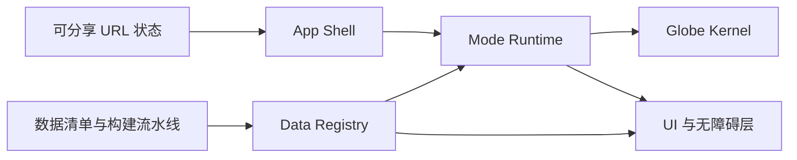

# Mundus：交互式三维地球实验室 V1 项目计划

- 状态：稳定的 V1 产品契约；V1.1.0 Parchment Atlas 已于 2026-08-02 上线
- 当前执行入口：`docs/ROADMAP_HANDOFF.md`
- 更新日期：2026-08-02
- 内部项目名：Mundus

## 1. 项目定位

Mundus 是一个“数字博物馆展品 × 科学仪器 × 互动图鉴”式的三维地球实验室。

> 每个模式都是一副重新观察地球的镜片，而不是传统地图中的一个图层。

项目主要面向普通探索者、数据可视化与前端图形从业者、作品集评审者，以及后续的科学传播和开源模式贡献者。不服务导航、街道级查询、专业 GIS 编辑或测绘。

首版确认采用：

- 三个深度模式，而不是大量浅层图层。
- 深色博物馆式视觉：艺术化地球、克制发光、编辑式排版，不使用写实卫星底图或赛博 HUD。
- 中英双语界面和文档。
- 首屏直接进入可交互地球，不设置独立营销落地页。
- 桌面优先设计，同时保证移动端完整可操作。

核心体验循环：选择一种观察方式，操纵地球，获得一个清晰发现，查看解释与来源，分享当前状态，再进入下一个模式。

## 2. V1 产品范围

### 2.1 地球另一端 / Other Side

这是首版默认入口和标志性模式。

- 通过点击、坐标输入、本地城市搜索或主动授权定位选择地点。
- 同时标记起点与对跖点，用穿过地心的连线和镜头翻转表现空间关系。
- 展示精确双方坐标、国家或海洋、地心直线距离和半球表面距离，并分别显示 GeoNames 固定快照中距两端最近的符合条件主要城市；它们不是最近聚居地、行政边界或建成区结果。
- 提供精选示例，帮助用户在十秒内理解模式。
- 分享精确位置前提示坐标会写入 URL，并允许降低坐标精度。

### 2.2 发展的不同侧面 / Development, Unpacked

这个模式不做任意指标大杂烩，而是回答：“相近的发展水平可能由哪些不同结构组成？”

- 默认展示 HDI，可切换健康、教育、收入维度和年份。
- 国家结果卡展示数值、年份、全球中位数、历史变化、缺失状态和来源。
- 颜色尺度、单位、数据年份和缺失值必须始终可见。
- 不以排行榜为主要叙事，避免将复杂发展问题压缩成单一名次。
- 提供与三维视图同步的语义化表格视图。

### 2.3 日照线 / Sunline

- 展示实时或任意日期的昼夜分界、晨昏带和太阳直射点。
- 支持时间播放、日期拖动、回到当前时间，以及赤道、回归线和极圈辅助线。
- 点选位置后展示太阳高度、昼夜状态和近似日出日落。
- 明确说明计算仅用于教育与互动展示，不是法律、航海或工程时间服务。

### 2.4 明确不进入 V1 的能力

- 后端、账号系统和云端用户数据。
- 远程插件市场或运行时加载第三方代码。
- 在线地理编码、街道级搜索和专业 GIS 工具。
- PWA、离线包和实时自然事件数据。
- 幸福指数数据；在取得明确开放再分发许可前不打包 World Happiness Report/Gallup 数据。

V1.1.0 Parchment Atlas 是当前公开产品。基于 GHSL 的 Human Morphology
尚未通过全球验证，不属于公开功能；其终止结论为
`STOP_GLOBAL_MORPHOLOGY`，Plans 2–7 保持冻结。只有项目另行重开并通过
数据、方法、性能与发布门禁后，才可重新讨论该共享观察叠层。后续文化方向也必须
先完成独立设计与许可验证，不是当前承诺。

## 3. 体验与视觉设计

### 3.1 信息架构

桌面布局：

- 左上：Mundus 品牌、当前模式名和一句问题式说明。
- 右侧：地点、国家或时间结果卡，默认保持轻量。
- 底部：当前模式的主控件、时间轴和图例。
- 右上：模式图鉴、分享、语言和设置。

移动端：

- 结果卡、图例和模式控件统一收进底部抽屉。
- 模式切换入口保持单手可达。
- 触摸旋转、缩放和点击分别校准，避免和页面滚动冲突。

### 3.2 交互原则

- 首次只显示一个可消失的拖拽与缩放提示；用户一操作即结束引导。
- 可使用极慢的初始自转；用户开始交互后停止。
- 模式切换默认保留镜头，让用户用不同镜片观察同一区域。
- 单个模式加载失败时只降级该模式，不让整个地球白屏。
- 选择、模式、指标和时间进入可分享 URL；连续相机变化只节流更新当前历史项。
- `prefers-reduced-motion` 下关闭自动旋转、长距离飞行动画和非必要粒子。

### 3.3 无障碍与降级

- 所有控制、结果和数据说明都存在于语义化 DOM 中，不能只存在于 Canvas。
- 支持键盘旋转、缩放、模式切换、结果浏览和焦点管理。
- 颜色不是唯一的数据编码；同时显示数值、标签、轮廓或其他视觉差异。
- 选择结果通过克制的 live region 宣读。
- 每个数据模式提供同步的列表或表格替代视图。
- WebGL2 初始化失败时显示静态地球预览、说明和仍可操作的坐标/数据界面。
- 按 [WCAG 2.2 AA](https://www.w3.org/TR/WCAG22/) 验收。

## 4. 技术方案

### 4.1 主技术栈

- Vite + React 19 + TypeScript strict。
- pnpm 和锁文件保证可复现安装。
- Three.js `WebGLRenderer` + React Three Fiber 9 + Drei。
- Zustand 管理应用、镜头和模式状态。
- Zod 校验 URL、模式状态和数据清单。
- `d3-geo`、`d3-scale`、`d3-format` 与 `topojson-client` 处理地理绘制、拾取和数据表达。
- CSS Modules、CSS 自定义属性和设计令牌构建设计系统，不引入通用 UI 组件库。
- Vitest、Testing Library 和 Playwright 负责单元、集成和真实浏览器测试。

项目产出纯静态 `dist`，默认部署到 GitHub Pages，同时保持任意静态托管平台兼容。[Vite 静态部署说明](https://vite.dev/guide/static-deploy.html)

### 4.2 渲染决策

V1 使用稳定的 WebGL2 路径，不把 WebGPU 当作首发依赖。[Three.js WebGLRenderer](https://threejs.org/docs/pages/WebGLRenderer.html)

- 自建薄型地球内核，不把 `globe.gl` 或 `three-globe` 的命令式 API 暴露给模式。
- Globe Kernel 只负责球体、气氛、光照、相机、坐标转换、拾取、质量等级和渲染循环。
- 国家着色使用动态等距矩形 `CanvasTexture`；球面点击转换为经纬度后，通过本地边界数据确定国家。
- 基础地球采用程序化海洋、Natural Earth 陆地轮廓和克制的大气边缘，不使用卫星影像。
- 默认使用 R3F `frameloop="demand"`；Sunline 播放和模式转场期间临时连续渲染。[R3F 性能指南](https://r3f.docs.pmnd.rs/advanced/scaling-performance)
- 高、中、低三档画质自动选择，用户可覆盖；移动端限制 DPR，并关闭高成本后处理。

MapLibre 保留为未来矢量瓦片和底图型功能的备选；Cesium 仅在出现高精地形、轨道或 3D Tiles 需求时考虑；deck.gl GlobeView 不进入首发核心。

## 5. 系统架构与接口



### 5.1 App Shell

负责响应式布局、语言、主题令牌、全局错误边界、WebGL 能力检测和分享入口。整个应用只有一个 WebGL Canvas。

### 5.2 Globe Kernel

负责：

- 经纬度与三维坐标的双向转换。
- 球面 raycast 和经纬度拾取。
- 相机、OrbitControls、程序化转场与镜头状态。
- 球体、气氛壳、经纬网、标记、弧线和自定义模式场景组。
- 渲染质量、DPR、暂停、context loss 和 GPU 资源释放。

Kernel 返回稳定的地理对象 ID，不向模式暴露具体 Mesh 结构。

### 5.3 Mode Runtime 与 `ModeDefinition<State>`

每个模式通过编译期注册和动态导入加载。模式定义固定包含：

- `id`、版本、分类、双语标题、摘要和缩略图。
- 类型化状态 Schema、默认值和 URL codec。
- 相机保留或重置策略。
- 数据资源清单和加载失败文案。
- 声明式图层、控件、图例和结果检查器。
- 文本摘要、表格/列表替代内容和无 WebGL 表现。
- 准备、激活、状态更新、停用和资源释放生命周期。

基础图层支持国家表面、点、弧、线、标记和太阳光照。特殊 shader 或 Three 对象通过受审查的 R3F 扩展组件实现。模式不得创建 renderer 或直接管理全局相机。

### 5.4 URL 状态

采用静态托管兼容的查询参数：

```text
/?mode=antipodes&v=1&point=31.2304,121.4737&cam=...
```

- 模式、选择、指标和时间变化写入浏览器历史。
- 相机连续变化节流后使用 `replaceState`。
- 默认值不写入 URL，浮点数限制精度。
- 每个模式维护自己的 codec 和版本迁移。
- localStorage 只保存语言和画质偏好。

### 5.5 Data Registry

每份数据必须提供机器可读清单：

- 来源名称和原始 URL。
- 许可证名称和许可证 URL。
- 数据版本、年份、获取时间和校验和。
- 筛选、简化、计算和字段映射步骤。
- 必须展示的署名。
- 是否允许原始数据或派生结果再分发。
- 缺失值与争议边界政策。

国家连接统一使用项目内部 `countryId` 和显式例外映射，不做运行时名称模糊匹配。

## 6. 数据方案与许可

### 6.1 国家与城市

- Natural Earth 110m 用作首屏国家轮廓与国家/海洋判断。
- GeoNames 固定快照提供双语主要城市搜索，以及精确起点和对跖点两侧的最近符合条件主要城市关系。
- 构建阶段生成轻量城市搜索索引和边界元数据。
- Natural Earth 数据属于公共领域；仍在来源页显示 “Made with Natural Earth”。[使用条款](https://www.naturalearthdata.com/about/terms-of-use/)
- 边界显示采用 Natural Earth 的制图视角，并明确声明它不是法律上的领土权威。

### 6.2 人类发展数据

- 使用 UNDP 最新完整 HDI 时序及健康、教育、收入相关字段。
- 按 CC BY 3.0 IGO 署名，记录所有字段变换和派生计算。[UNDP 使用条款](https://hdr.undp.org/terms-use)
- UNDP 会回溯重算历史序列，因此每次更新整版替换，不能混用不同发布版排名或时间序列。
- 小型规范化快照可进入仓库；原始大型文件不提交。

### 6.3 对跖点与日照

- 对跖点完全本地计算：纬度取反，经度加或减 180° 后规范化。
- 国家/海洋判断使用 Natural Earth 点落面查询，不依赖在线反向地理编码。
- 太阳位置基于 NOAA/Meeus 公开公式本地计算，并通过固定基准日期测试。

### 6.4 暂缓数据

World Happiness Report 部分数据虽然可以免费下载，但没有为再分发提供明确的开放许可，且核心 Gallup 数据另有使用限制。V1 不包含相关数据，也不采用 Kaggle 副本作为权利依据。[WHR 数据说明](https://worldhappiness.report/data-sharing/)、[Gallup 使用条款](https://news.gallup.com/poll/105949/world-poll-terms-use.aspx)

## 7. 数据流水线

- 构建阶段下载、校验、简化、归一化和生成派生资产。
- 小型且允许再分发的派生数据进入仓库；大型原始文件进入本地缓存并由脚本复现。
- 数据请求带版本与校验和，禁止运行时静默切换上游数据版本。
- 自动更新任务只创建待审查 PR，不直接覆盖生产数据。
- CI 检查 Schema、国家 ID 唯一性、年份范围、覆盖率、缺失值、署名和许可证字段。
- `null` 表示未知或缺失，任何流水线都不能把缺失值转成 0。

## 8. 开发阶段

### 阶段 1：基础与技术纵切，约 1 周

- 建立仓库、类型检查、测试、格式化、设计令牌、双语框架和 CI。
- 完成基础球体、相机、球面拾取、国家纹理、WebGL2 能力检测和 DOM fallback。
- 验证桌面和移动端性能、context loss 以及资源释放。

阶段门槛：国家 hover 与选择在桌面稳定 45–60fps，中档手机至少 30fps。

### 阶段 2：Other Side，约 2 周

- 完成模式运行时和第一个 `ModeDefinition`。
- 完成点击、坐标输入、本地城市搜索和主动定位。
- 完成对跖计算、地心连线、镜头转场、结果卡、精选示例和分享 URL。
- 形成可独立发布的高完成度纵切。

### 阶段 3：Development, Unpacked，约 2 周

- 完成 UNDP 数据获取、转换、校验和来源页。
- 完成国家着色、指标切换、时间轴、图例、结果卡和缺失值表现。
- 完成同步表格视图和数据方法说明。

### 阶段 4：Sunline 与视觉打磨，约 2 周

- 实现太阳位置、晨昏 shader、时间播放和辅助纬线。
- 完成响应式底部抽屉、键盘导航、减少动态效果和自动画质。
- 完成模式转场、加载状态、错误状态和双语文案。

### 阶段 5：开源发布，约 1 周

- 补齐中英 README、CONTRIBUTING、CODE_OF_CONDUCT、SECURITY 和 DATA_SOURCES。
- 增加模式提案模板、最小示例模式和贡献检查清单。
- 完成社交预览、生产构建、GitHub Pages 部署和作品集案例说明。

总计约 7–8 个全职等效周；个人业余开发按 12–16 个日历周规划。

## 9. 测试方案

### 9.1 单元测试

- 经纬度与三维坐标往返。
- 对跖变换二次执行后还原原点。
- 极点、日期变更线和经度规范化。
- 太阳位置在春分、夏至、秋分、冬至及固定地点的基准值。
- 颜色尺度、单位格式、缺失值和中位数计算。
- URL codec 往返、非法参数回退和版本迁移。
- 国家 ID 映射和数据覆盖校验。

### 9.2 集成测试

- 模式动态加载、激活、停用、请求取消和资源释放。
- 单模式失败时的错误隔离与重试。
- 国家拾取、语言切换、署名展示和表格同步。
- WebGL2 不可用、context loss 和低画质路径。

### 9.3 浏览器测试

- 桌面拖拽、滚轮、点击、键盘与模式切换。
- 移动端触摸旋转、缩放、抽屉和触控目标。
- 分享链接在重载后恢复模式、镜头、选择和参数。
- `prefers-reduced-motion` 和语言切换。
- 固定浏览器、GPU backend、视口、DPR、相机和时间的视觉回归。

## 10. 发布验收门槛

- 首屏桌面 3 秒、移动 4G 5 秒内可交互。
- 首屏压缩资源不超过约 1.2 MB，其余模式与 GeoNames 城市索引懒加载。
- 缓存后的模式切换在 500ms 内出现可见反馈。
- 连续切换模式 20 次后 GPU 对象、监听器和内存不持续增长。
- 用户无需阅读教程即可在 10 秒内完成第一次发现。
- 三个模式视觉与操作明显不同，但全部通过同一模式契约加载。
- 分享链接重载后恢复模式、镜头、选择、指标和时间。
- 每个数据结果都有年份、来源、许可、方法和缺失状态。
- 中英双语、桌面、移动、键盘、减少动态效果和无 WebGL 路径均可用。
- CI 必须通过类型检查、Lint、单元测试、数据校验、生产构建和浏览器冒烟测试。

## 11. 开源与维护约定

- 代码使用 MIT License；第三方数据、字体和素材按各自许可证声明。
- 新模式先提交 Mode Proposal，说明观察问题、为什么必须使用地球、数据许可、视觉编码、无障碍方案和资源预算。
- 模式分为 `experimental`、`community` 和 `curated`；只有通过数据、性能、视觉和无障碍检查后进入默认图鉴。
- 首期只接受编译期注册的仓库内模式，不建立远程插件市场。
- 核心模式接口版本化，旧 URL 状态提供迁移，不允许静默失效。
- 使用 DCO/签署提交即可，V1 不引入 CLA。
